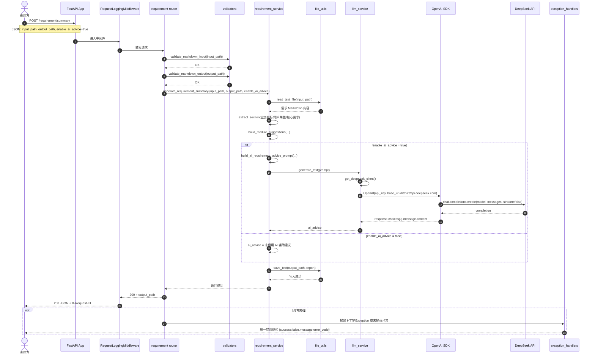

# API 调用 DeepSeek 生成 requirement summary 时序图

```mermaid
sequenceDiagram
    autonumber
    actor Client as 调用方
    participant API as FastAPI App
    participant MW as RequestLoggingMiddleware
    participant Router as requirement router
    participant Validator as validators
    participant ReqSvc as requirement_service
    participant File as file_utils
    participant LLM as llm_service
    participant SDK as OpenAI SDK
    participant DS as DeepSeek API
    participant EH as exception_handlers

    Client->>API: POST /requirement/summary
    Note over Client,API: JSON: input_path, output_path, enable_ai_advice=true
    API->>MW: 进入中间件
    MW->>Router: 转发请求

    Router->>Validator: validate_markdown_input(input_path)
    Validator-->>Router: OK
    Router->>Validator: validate_markdown_output(output_path)
    Validator-->>Router: OK

    Router->>ReqSvc: generate_requirement_summary(input_path, output_path, enable_ai_advice)

    ReqSvc->>File: read_text_file(input_path)
    File-->>ReqSvc: 需求 Markdown 内容
    ReqSvc->>ReqSvc: extract_section(业务目标/用户角色/核心需求)
    ReqSvc->>ReqSvc: build_module_suggestions(...)

    alt enable_ai_advice = true
        ReqSvc->>ReqSvc: build_ai_requirement_advice_prompt(...)
        ReqSvc->>LLM: generate_text(prompt)
        LLM->>LLM: get_deepseek_client()
        LLM->>SDK: OpenAI(api_key, base_url=https://api.deepseek.com)
        SDK->>DS: chat.completions.create(model, messages, stream=false)
        DS-->>SDK: completion
        SDK-->>LLM: response.choices[0].message.content
        LLM-->>ReqSvc: ai_advice
    else enable_ai_advice = false
        ReqSvc-->>ReqSvc: ai_advice = 未启用 AI 辅助建议
    end

    ReqSvc->>File: save_text(output_path, report)
    File-->>ReqSvc: 写入成功
    ReqSvc-->>Router: 返回成功
    Router-->>MW: 200 + output_path
    MW-->>Client: 200 JSON + X-Request-ID

    opt 异常路径
        Router->>EH: 抛出 HTTPException 或未捕获异常
        EH-->>Client: 统一错误结构 {success:false,message,error_code}
    end
```
