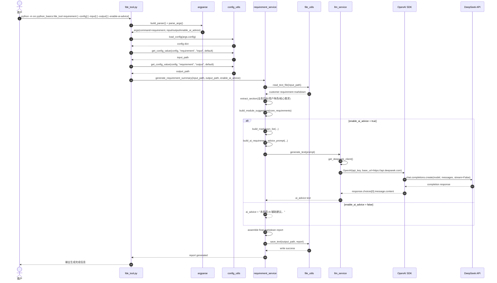

# CLI 调用 DeepSeek 生成 requirement summary 时序图

```mermaid
sequenceDiagram
    autonumber
    actor User as 用户
    participant CLI as fde_tool.py
    participant ArgParse as argparse
    participant Config as config_utils
    participant ReqSvc as requirement_service
    participant File as file_utils
    participant LLM as llm_service
    participant OpenAI as OpenAI SDK
    participant DeepSeek as DeepSeek API

    User->>CLI: python -m src.python_basics.fde_tool requirement [--config] [--input] [--output] [--enable-ai-advice]
    CLI->>ArgParse: build_parser() + parse_args()
    ArgParse-->>CLI: args(command=requirement, input/output/enable_ai_advice)

    CLI->>Config: load_config(args.config)
    Config-->>CLI: config dict

    CLI->>Config: get_config_value(config, "requirement", "input", default)
    Config-->>CLI: input_path
    CLI->>Config: get_config_value(config, "requirement", "output", default)
    Config-->>CLI: output_path

    CLI->>ReqSvc: generate_requirement_summary(input_path, output_path, enable_ai_advice)

    ReqSvc->>File: read_text_file(input_path)
    File-->>ReqSvc: customer requirement markdown

    ReqSvc->>ReqSvc: extract_section(业务目标/用户角色/核心需求)
    ReqSvc->>ReqSvc: build_module_suggestions(core_requirements)

    alt enable_ai_advice = true
        ReqSvc->>ReqSvc: build_markdown_list(...)
        ReqSvc->>ReqSvc: build_ai_requirement_advice_prompt(...)
        ReqSvc->>LLM: generate_text(prompt)
        LLM->>LLM: get_deepseek_client()
        LLM->>OpenAI: OpenAI(api_key, base_url=https://api.deepseek.com)
        OpenAI->>DeepSeek: chat.completions.create(model, messages, stream=False)
        DeepSeek-->>OpenAI: completion response
        OpenAI-->>LLM: response.choices[0].message.content
        LLM-->>ReqSvc: ai_advice text
    else enable_ai_advice = false
        ReqSvc-->>ReqSvc: ai_advice = "未启用 AI 辅助建议。"
    end

    ReqSvc->>ReqSvc: assemble final markdown report
    ReqSvc->>File: save_text(output_path, report)
    File-->>ReqSvc: write success
    ReqSvc-->>CLI: report generated
    CLI-->>User: 输出生成完成信息
```
